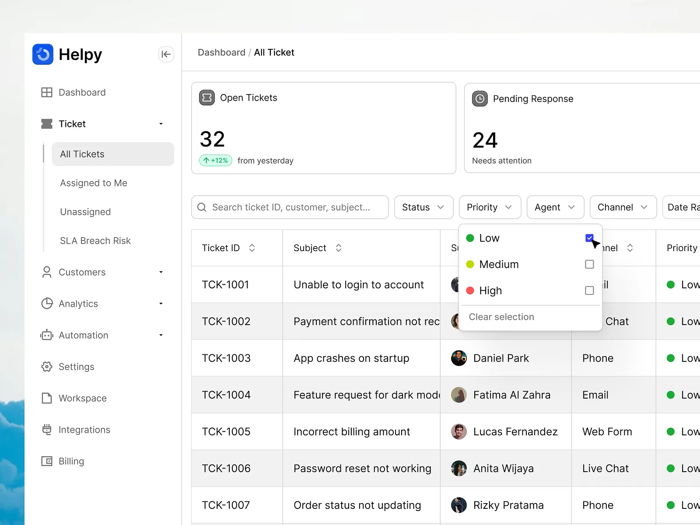

1. we need to have an account type administrator that can see all the tickets and where the tickets are assigned to what agent,

1.1. the administrator can assign tickets to specific agents

2. there may be multiple agents belonging to different agent type: (hr, software, hardware,) and this can be extendible 

3. improve the dashboard to have like this looks refer to the image   

4. for the agent dashboard, there must be a stat on top that shows open, pending, close, tickets

5. agents can assign tickets to them, and when assgined, it will correspondingly display to the users ticket also that their ticket is assigned to a certain agent.

6. 